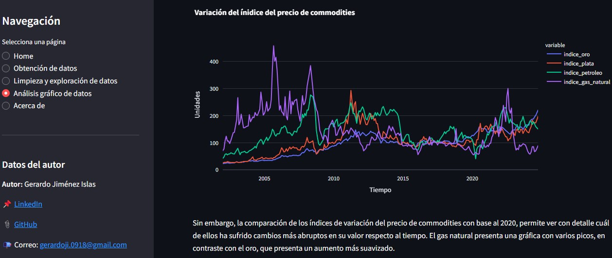

# Relación entre el precio de commodities e índices de precios al consumidor en España y México. 📈

**¡Hola!** 🚂🚂  Soy Gerardo Jiménez [LinkedIn](https://www.linkedin.com/in/gerardo-jimenez-islas/), ingeniero de minas y metalurgista, entusiasta de data science y la programación.

En este post comparto un breve análisis gráfico desarrollado durante mi Ironhack Data Analyst bootcamp.

El objetivo principal, fue aplicar técnicas de web scraping y uso de APIs para la obtención de datos, aplicar funciones de estandarización y limpieza de datos, y generar insights sobre la infromación resultante. Además, mediante Streamlit se creó un frontend para mostrar los resultados finales.

##  Overview

### ¿El precio de los alimentos sube cuando el precio del oro aumenta? 💰💰💰💰
### ¿Si los precios suben, aumentan los suicidios? 💸💀

Estas son algunas de las hipótesis con las que se desarrolló la investigación. 


### 💻 Fuentes de consulta

- Web scraping en sitios web, por medio de la librería selenium. 
- Empleo de la API de Yahoo Finance mediante la librería yfinance.
- Descarga de datos gubernamentales.

** Implementación de funciones para interpolación de datos faltantes en el dataframe**

```python

def completar_columnas_interpolacion(df):
    import pandas as pd

    #Rellena las fechas faltantes en la columna 'date' y 
    #realiza la interpolación de los valores faltantes en las demás columnas.

    #Parámetros:
    #df (DataFrame): El dataframe con una columna 'date'

    #Retorna:
    #DataFrame: El dataframe con las fechas completadas y los valores interpolados.

    # Asegúrate de que la columna 'date' sea de tipo datetime
    df['date'] = pd.to_datetime(df['date'])

    # Crear un rango de fechas completo (mensual) desde la fecha mínima hasta la máxima
    fechas_completas = pd.date_range(start=df['date'].min(), end=df['date'].max(), freq='MS')

    # Reindexar el dataframe con el rango completo de fechas
    df_completo = df.set_index('date').reindex(fechas_completas).reset_index()

    # Renombrar la columna 'index' a 'date'
    df_completo = df_completo.rename(columns={'index': 'date'})

    # Interpolar los valores faltantes en las otras columnas
    df_completo = df_completo.interpolate(method='linear')

    return df_completo
```


### 💡 Experiencia durante el desarrollo

- La creación de un frontend básico mediante el uso de Streamlit es una rápida solución para dar lugar a un espacio donde publicar información.

- Los métodos utilizados para la obtención de datos permiten generar un dataframe con infromación proveniente de muchas fuentes, y esto puede enriquecer los análisis.

- Finalmente, se destaca la importancia de crear funciones genéricas, que se puedan aplicar a otros set de datos sin requerir de muchas modificaciones. Lo anterior, acompañado de una buena documentación, es clave para trabajar de manera eficiente. 

---

## 🚩 Visualiza los resultados del análisis 🚩

**Frontend en Streamlit**

📔 **Échale un vistazo:** 
https://commodities-inpc-ipc-data.streamlit.app/
